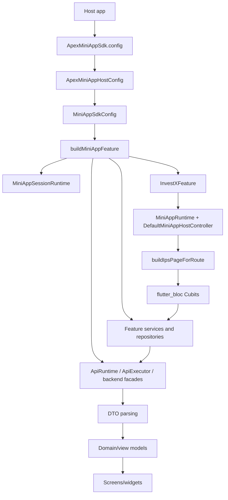
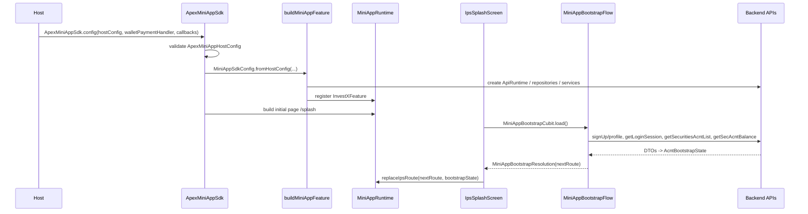
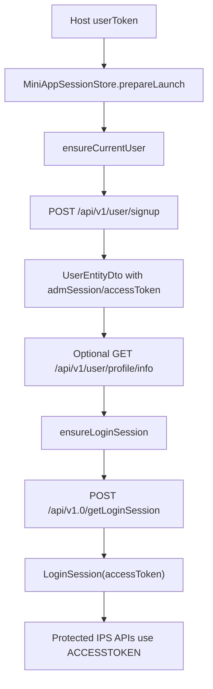
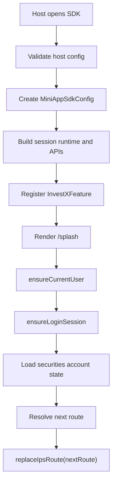
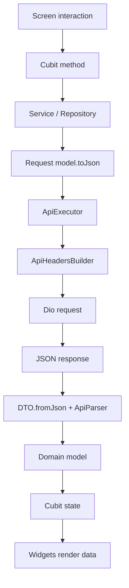
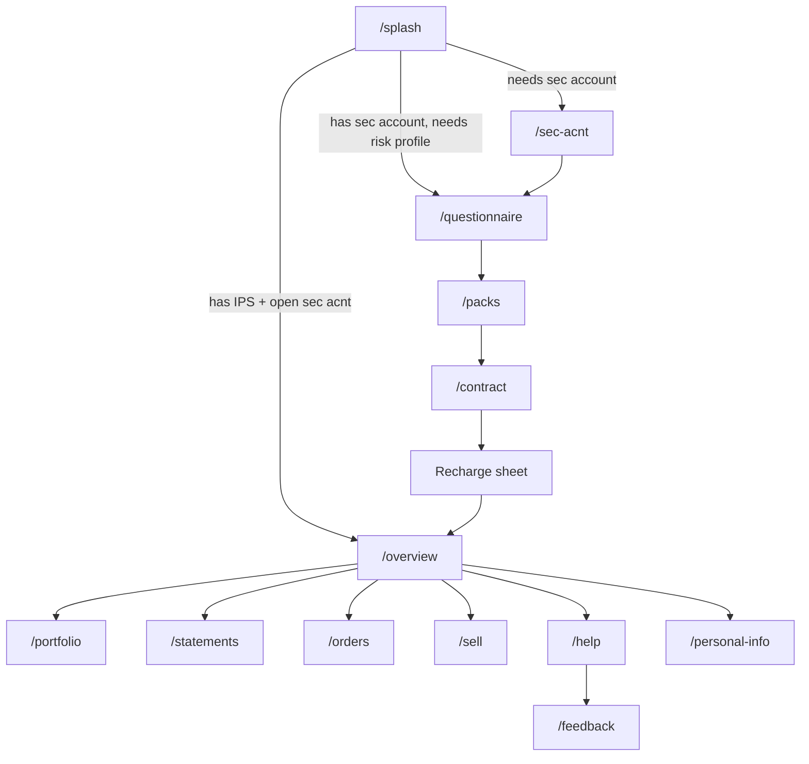
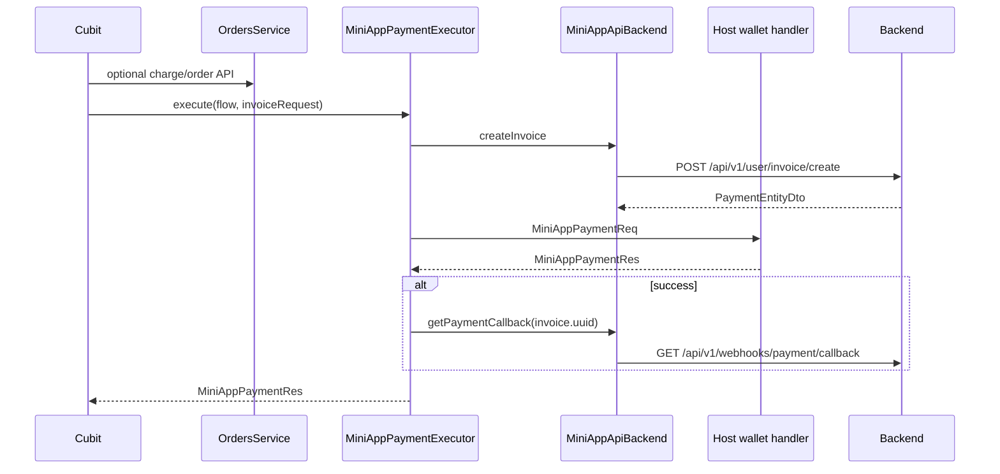

# Apex Mini App хөгжүүлэгчид хүлээлгэн өгөх баримт

Шалгасан огноо: 2026-05-21  
Repository root: `/Users/o.battogtokh/products/front_app/apex_mini_app`  
Үндсэн технологи: Flutter/Dart monorepo, Melos маягийн package бүтэцтэй

Энэ баримтыг repository доторх source, config, API, model, route, shared UI, localization, asset, test файлуудыг шалгасны үндсэн дээр бичив. Код дээр нотлогдоогүй, эсвэл олдоогүй зүйлсийг **Код дээр олдсонгүй** эсвэл **Баталгаажуулах шаардлагатай** гэж тэмдэглэв. API request/response JSON жишээнүүдийг `toJson` болон `fromJson` кодоос гарган таамагласан бол "код дээрээс дүгнэсэн" гэж ойлгоно.

## 1. Төслийн ерөнхий зураг

### Энэ төсөл юу вэ

Энэ repository нь Apex/InvestX хөрөнгө оруулалтын mini app-ийг host Flutter апп дотор embed хийх SDK юм. Host апп нь хэрэглэгчийн token, runtime URL, credential, locale, wallet payment callback, алдаа/token-expired callback зэргийг өгнө. SDK нь дотроо тусгаарласан mini app navigation/runtime үүсгээд InvestX-ийн onboarding, үнэт цаасны данс, асуулга, багц сонголт, гэрээ, цэнэглэлт, зарлага, portfolio, захиалга, хуулга, тусламж, санал хүсэлт, profile засварын урсгалыг харуулдаг.

Repository нь дараах package-уудаас бүрдэнэ.

| Package | Үүрэг |
|---|---|
| `packages/apex_mini_app_core` | Mini app runtime contract, launch/payment model, route spec, registry. Flutter UI-гүй цэвэр Dart contract layer. |
| `packages/apex_mini_app_ui` | Shared UI/runtime shell: adaptive app wrapper, mini app host controller, theme, typography, responsive helper, common widgets. |
| `packages/apex_mini_app_sdk` | Үндсэн SDK: public `ApexMiniAppSdk`, host config, DI, API, session, business flow, screen, localization, assets. |
| `packages/apex_mini_app_example` | SDK-г host app дээр хэрхэн дуудахыг харуулсан жишээ Flutter апп, wallet payment simulation-тэй. |

### Үндсэн зорилго ба бизнес логик

SDK-ийн гол зорилго нь host аппын хэрэглэгчид InvestX хөрөнгө оруулалтын үйлчилгээ ашиглуулах:

1. Host-оос ирсэн token-оор SDK session бэлтгэх.
2. TechInvestX user/profile мэдээлэл авах.
3. Protected IPS session token авах.
4. Хэрэглэгчийн үнэт цаас/IPS дансны төлөвийг шалгах.
5. Дараагийн шаардлагатай flow руу автоматаар чиглүүлэх.
6. Хэрэглэгчид portfolio, order, statement, recharge, sell, help, feedback зэрэг үйлдлийг хийх боломж өгөх.

Startup route шийдвэрлэх үндсэн дүрэм `packages/apex_mini_app_sdk/lib/src/app/bootstrap/mini_app_bootstrap_flow.dart` дотор байна.

| Нөхцөл | Дараагийн route |
|---|---|
| Үнэт цаасны данстай, IPS данстай, данс нээгдсэн | `/overview` |
| Үнэт цаасны данстай, IPS дансгүй, profile мэдээлэл бүрэн | `/questionnaire` |
| Үнэт цаасны данстай, IPS дансгүй, profile мэдээлэл дутуу | `/sec-acnt` |
| Бусад бүх тохиолдол | `/sec-acnt` |

### Гол хэрэглэгчийн урсгалууд

| Flow | Route | Бодит chain |
|---|---|---|
| Host launch | Host app -> `ApexMiniAppSdk.config` | Host config -> `MiniAppSdkConfig` -> `MiniAppSdk` -> `MiniAppRuntime` -> `InvestXFeature` -> `/splash`. |
| Bootstrap | `/splash` | `IpsSplashScreen` -> `MiniAppBootstrapCubit` -> `MiniAppBootstrapFlow.resolve()` -> session/profile/login/account APIs -> `replaceIpsRoute(nextRoute)`. |
| Үнэт цаасны данс | `/sec-acnt` | Consent -> personal info -> agreement -> signature -> payment/calculation -> questionnaire/overview. |
| Асуулга | `/questionnaire` | Agreement -> signature -> recommendation intro -> questions -> score calculation -> `/packs`. |
| Багц/гэрээ | `/packs` -> `/contract` | `PackSelectionScreen` -> `ContractPayload` -> `IpsContractCubit.initialize()` -> `addBkrCustContract` -> IPS account refresh -> recharge sheet. |
| Dashboard | `/overview` | `IpsOverviewCubit` -> bootstrap + portfolio + pack -> home/profile tabs. |
| Portfolio | `/portfolio` | `IpsPortfolioCubit` -> `PortfolioService.getDashboardData()` -> balance/holding/chart widgets. |
| Recharge | `/recharge` эсвэл bottom sheet | `IpsRechargeCubit` -> pricing -> `chargeIpsAcnt` -> invoice -> host wallet -> callback. |
| Sell | `/sell` | `IpsSellCubit` -> pricing + selected pack -> `createIpsSellOrder` -> success -> refresh packs. |
| Statement | `/statements` | `IpsStatementsCubit` -> `getBkrPublicCasaAcntStmt` -> filter -> list. |
| Help/Feedback | `/help`, `/feedback` | company info, social/location launcher, feedback list/create. |

### Төслийн одоогийн байдал

- SDK integration boundary ажиллах бүтэцтэй.
- Feature flow-уудын ихэнх нь implemented.
- Test folder нэлээд өргөн хүрээтэй.
- Persistent storage, secure storage, database layer олдсонгүй.
- CI/CD pipeline олдсонгүй.
- Production-д шууд эрсдэлтэй hardcoded secret, hardcoded contract bank data, route argument crash зэрэг асуудлууд байна.

## 2. Архитектур

### Ерөнхий архитектур



### Folder бүтэц

| Path | Тайлбар |
|---|---|
| `pubspec.yaml` | Workspace-level Dart SDK болон dev dependency. |
| `melos.yaml` | `packages/**`-ийг workspace package гэж бүртгэнэ. Script олдсонгүй. |
| `analysis_options.yaml` | Shared lint config. `implementation_imports`, `use_build_context_synchronously` error болгосон. |
| `README.md` | Host integration заавар. Ихэнх нь монгол хэл дээр. |
| `packages/apex_mini_app_core/lib` | Runtime contract, registry, launch/payment model. |
| `packages/apex_mini_app_ui/lib` | Mini app UI shell, runtime controller, theme, responsive, common widgets. |
| `packages/apex_mini_app_sdk/lib/apex_mini_app_sdk.dart` | SDK public export. |
| `packages/apex_mini_app_sdk/lib/src/host` | Host config, callbacks, SDK root widget, local close/token-expired bridge. |
| `packages/apex_mini_app_sdk/lib/src/config` | Internal `MiniAppSdkConfig`. |
| `packages/apex_mini_app_sdk/lib/src/di` | Manual dependency composition. |
| `packages/apex_mini_app_sdk/lib/src/core/api` | Dio client, headers, executor, parser, API config, error handling. |
| `packages/apex_mini_app_sdk/lib/src/app/session` | Host token -> current user -> login session lifecycle. |
| `packages/apex_mini_app_sdk/lib/src/app/api` | TechInvestX profile/payment/support API facade, repositories, DTO, request. |
| `packages/apex_mini_app_sdk/lib/src/app/bootstrap` | Startup bootstrap болон next-route decision. |
| `packages/apex_mini_app_sdk/lib/src/features/router` | Route бүрийг screen builder-тэй холбодог layer. |
| `packages/apex_mini_app_sdk/lib/src/features/*` | Feature бүрийн application/data/domain/presentation layer. |
| `packages/apex_mini_app_sdk/lib/src/payment` | Host wallet payment executor. |
| `packages/apex_mini_app_sdk/lib/src/runtime` | `MiniAppSdk`, `MiniAppLaunchContext`. |
| `packages/apex_mini_app_sdk/lib/l10n` | ARB болон generated `SdkLocalizations`. |
| `packages/apex_mini_app_sdk/assets/icons` | SDK asset-ууд. |
| `packages/apex_mini_app_example/lib` | Example host implementation. |

### Layer тусгаарлалт

| Layer | Үүрэг | Жишээ файл |
|---|---|---|
| Host boundary | Host config validation, callback bridge, isolated SDK app tree. | `host/apex_mini_app_sdk.dart`, `host/apex_mini_app_host_config.dart` |
| Runtime | Module/route register, push/replace page. | `apex_mini_app_ui/lib/src/runtime/*`, `runtime/mini_app_sdk.dart` |
| DI | API, repository, service, feature dependency үүсгэх. | `di/mini_app_sdk_di.dart`, `di/ips_dependencies.dart` |
| API core | Request, headers, response parse, exception mapping. | `core/api/*` |
| Session | Current user болон IPS access token lifecycle. | `app/session/*` |
| Application | Cubit, state, use-case flow. | `features/*/application/*` |
| Data | API extension, repository, DTO, request. | `features/*/data/*`, `app/api/*` |
| Domain | UI-independent object. | `features/*/domain/*` |
| Presentation | Screen/widget. | `features/*/presentation/*` |

### State management

State management нь `flutter_bloc` Cubit дээр суурилсан.

- Generic state: `features/shared/application/loadable_state.dart` дотор `LoadableState<T>`.
- Feature state: `FeedbackState`, `IpsRechargeState`, `IpsSellState`, `IpsOrdersState`, `IpsContractState`, `IpsQuestionnaireState`, `IpsSecAcntState`.
- Session state: `MiniAppSessionStore extends Cubit<MiniAppSessionState>`.
- Ихэнх Cubit route builder дээр `BlocProvider`-оор үүсдэг.

### Routing/navigation

Route constant-ууд `packages/apex_mini_app_sdk/lib/src/routes/mini_app_routes.dart` дотор байна. Runtime route registration `features/router/ips_routes.dart`, route -> page mapping `features/router/ips_route_builder.dart`.

Flutter named-route ашиглаагүй. Дотоод navigation дараах helper-ээр явна.

- `launchIpsRoute(context, route: ..., arguments: ...)`
- `replaceIpsRoute(context, route: ..., arguments: ...)`

Эдгээр helper нь `MiniAppHostController`-ийг дараах дарааллаар хайна.

1. Local `MiniAppHostControllerProvider`.
2. Active controller registry.
3. `ApexMiniAppHostContext.activeController`.

### Dependency bundle

Үндсэн dependency bundle нь `IpsDependencies`.

| Field | Үүрэг |
|---|---|
| `sessionStore`, `sessionController` | Token/current user/login session state. |
| `appApi` | Profile, feedback, support, payment repository facade. |
| `ipsApi` | Protected IPS backend facade. |
| `bootstrapService` | Account bootstrap, securities account actions. |
| `questionnaireService` | Risk questionnaire API logic. |
| `packService` | Pack recommendations. |
| `contractService` | Broker contract creation. |
| `portfolioService` | Balance, holdings, statements. |
| `ordersService` | Recharge, sell, order list/cancel. |
| `bankOptionsRepository`, `bankAccountLookupRepository` | Bank сонголт ба account holder lookup. |
| `paymentExecutor` | Host wallet payment orchestration. |
| `bootstrapFlow` | Startup next-route resolver. |
| `logger` | Diagnostic logger. |

### Central config

| File | Үүрэг |
|---|---|
| `host/apex_mini_app_host_config.dart` | Host-оос ирэх public config. Token, URL, route validation хийдэг. |
| `config/mini_app_sdk_config.dart` | Runtime-д ашиглах normalized internal config. |
| `core/api/static_api_config.dart` | Hardcoded dev/prod URL, credentials, NE session, FI code, storage URL. |
| `core/backend/sdk_runtime_config.dart` | Runtime API URL, credential, token, language, debug flag. |
| `core/backend/sdk_backend_config.dart` | Runtime/bootstrap/portfolio/contract config aggregate. |
| `packages/apex_mini_app_sdk/l10n.yaml` | Localization generation config. |

Environment variables: **Код дээр олдсонгүй**. Одоогоор host config болон `StaticApiConfig`-оор орчноо сонгодог.

## 3. App startup flow

### Entry point

| Runtime | Entry point |
|---|---|
| Example app | `packages/apex_mini_app_example/lib/main.dart` -> `runApp(const MiniAppExampleApp())` |
| SDK widget | `packages/apex_mini_app_sdk/lib/src/host/apex_mini_app_sdk.dart` -> `ApexMiniAppSdk.config(...)` |
| SDK runtime | `packages/apex_mini_app_sdk/lib/src/runtime/mini_app_sdk.dart` -> `MiniAppSdk` |
| Feature module | `packages/apex_mini_app_sdk/lib/src/features/router/investx_feature.dart` -> `InvestXFeature` |
| Эхний screen | `/splash` -> `IpsSplashScreen` |

### Startup chain



### Initialization order

1. Host `ApexMiniAppHostConfig` үүсгэнэ.
2. `ApexMiniAppSdk` config validate хийж `ApexMiniAppHostContext`-д callback/controller bridge bind хийнэ.
3. `MiniAppSdkConfig.fromHostConfig` дараах mapping хийдэг:
   - `token` -> `userToken`
   - URLs -> runtime URLs
   - `locale` -> backend `language` (`en` бол `EN`, бусад нь `MN`)
   - host user/session -> internal host model
   - callbacks/payment handler.
4. `MiniAppSdk` нь `buildMiniAppFeature(config)` дуудна.
5. DI дараах объектуудыг үүсгэнэ:
   - `MiniAppSessionRuntime`
   - TechInvestX болон IPS `ApiRuntime`
   - repository/service-үүд
   - `MiniAppPaymentExecutor`
   - `InvestXFeature`.
6. `MiniAppRuntime` feature-г register хийж `DefaultMiniAppHostController` үүсгэнэ.
7. `ApexMiniAppSdk` isolated `MiniAppPlatformApp` build хийнэ:
   - `DesignTokens.theme`
   - SDK + Flutter localization delegates
   - host locale
   - SDK navigator/scaffold messenger key.
8. `/splash` render хийнэ.
9. `MiniAppBootstrapCubit.load()` дараагийн route-г шийднэ.

### Session restore/auth startup



Session persistent биш, memory-only. App kill/recreate бол host token-оор дахин bootstrap хийнэ.

## 4. Бүтэн codebase execution flow

### Host launch -> main screen chain

`MiniAppExampleApp._openMiniApp` -> `ApexMiniAppSdk.config` -> `_ApexMiniAppSdkState._configure` -> `MiniAppSdkConfig.fromHostConfig` -> `MiniAppSdk` -> `buildMiniAppFeature` -> `InvestXFeature` -> `ApexMiniAppSdk._buildInitialPage` -> `InvestXFeature.buildPage` -> `buildIpsPageForRoute('/splash')` -> `MiniAppBootstrapCubit.load` -> `MiniAppBootstrapFlow.resolve` -> `replaceIpsRoute(nextRoute, bootstrapState)`.

Гол launch object-ууд:

| Object | File | Гол field |
|---|---|---|
| `ApexMiniAppHostConfig` | `host/apex_mini_app_host_config.dart` | `token`, `devMode`, URLs, locale, `entryRoute`, `initialArguments`, host user/session, app credentials, FI defaults. |
| `MiniAppSdkConfig` | `config/mini_app_sdk_config.dart` | `userToken`, `walletPaymentHandler`, `paymentTimeout`, runtime URLs/credentials, host user/session, callbacks. |
| `MiniAppLaunchContext` | `runtime/mini_app_launch_context.dart` | `userToken`, `hostUser`, `hostSession`, original route arguments. |
| `MiniAppLaunchReq` | `apex_mini_app_core/lib/src/model/launch/mini_app_launch_req.dart` | `route`, `arguments`. |
| `MiniAppLaunchRes` | `apex_mini_app_core/lib/src/model/launch/mini_app_launch_res.dart` | `status`, `route`, `data`, `errorCode`, `errorMessage`. |

### Service/repository pattern

Ерөнхий хэлбэр:

`Screen` -> `Cubit` -> `Service` -> `Repository/Backend facade` -> `ApiExecutor` -> `Dio` -> JSON -> `DTO.fromJson` -> domain model -> cubit state -> widget.

Жишээ:

- `PortfolioScreen` -> `IpsPortfolioCubit.load()` -> `ApiPortfolioService.getDashboardData()` -> `IpsBackendPortfolioApi.getIpsOverview/getYieldProfitResponse/getStockYieldDetail` -> `PortfolioOverviewDto`/`PortfolioHoldingDto` -> `IpsPortfolioViewData` -> portfolio widgets.
- `QuestionnaireQuestionScreen` -> `IpsQuestionnaireCubit.submit()` -> `ApiQuestionnaireService.calculateScore()` -> `IpsBackendQuestionnaireApi.calculateScore` -> `QuestionnaireResDto` -> `/packs` argument.
- `RechargeScreen` -> `IpsRechargeCubit.submit()` -> `ApiOrdersService.chargeIpsAcnt()` -> `MiniAppPaymentExecutor.execute()` -> `MiniAppApiBackend.createInvoice()` -> host wallet handler -> `getPaymentCallback()`.

## 5. API flow ба backend communication

### Shared headers

`ApiHeadersBuilder` дараах header-үүдийг үүсгэнэ.

| Header | Эх сурвалж |
|---|---|
| `Accept: application/json` | constant |
| `APPID` | `AppCredentials.appId` |
| `APPSECRET` | `AppCredentials.appSecret` |
| `Authorization: Bearer <token>` | TechInvestX profile/current-user runtime |
| `ACCESSTOKEN: <token>` | Protected IPS runtime |
| `NESSESSION` | Login session API extra headers |

### API runtime behavior

- HTTP client: `Dio`, wrapper нь `ApiClient`.
- Cookie: in-memory `CookieJar`.
- 401/403: `SessionRefreshInterceptor` -> `MiniAppSessionController.refreshLoginSession()` -> `ACCESSTOKEN` update -> нэг удаа retry.
- Non-auth retry: **Код дээр олдсонгүй**.
- Error mapping: `ApiExecutor` нь `ApiException` subclass руу хөрвүүлнэ.

### API catalog

| API | Method/path | Request | Parser/model | Caller | UI |
|---|---|---|---|---|---|
| Signup | `POST /api/v1/user/signup` | `{ "token": "..." }` | `UserEntityDto` | `RemoteSignupBootstrapRepository.signUp` | Бүх session/bootstrap. |
| Profile info | `GET /api/v1/user/profile/info` | none | `UserEntityDto` | profile repository, signup hydration | Overview/profile/onboarding. |
| Goal questions | `GET /api/v1/user/question/get-all` | none | `QuestionnaireQuestionDto` | `ApiQuestionnaireService.getQuestions` | Questionnaire goal step. |
| Update profile | `PUT /api/v1/user/profile/update` | `UpdateProfileApiReq` | `ApiActionResponseDto` | Personal info, sec-account profile submit | Profile/onboarding. |
| Update target goal | `PUT /api/v1/user/profile/update-target-goal` | `{ "goal_id": 1 }` | `ApiActionResponseDto` | `IpsQuestionnaireCubit` | Questionnaire. |
| Upload signature | `PUT /api/v1/user/profile/update-signature` | multipart `signature` | `ApiActionResponseDto` | `SignatureUploadService` | Signature screens. |
| Create feedback | `POST /api/v1/user/feedback/create` | title/description | `CreateFeedbackResponseDto` | `FeedbackCubit` | Feedback create. |
| Feedback list | `POST /api/v1/user/feedback/list` | limit/page | `FeedbackListResponseDto` | `FeedbackCubit` | Feedback list. |
| Company info | `GET /api/v1/user/company/get-info` | none | `CompanyInfoResponseDto` | `HelpCubit` | Help. |
| Create invoice | `POST /api/v1/user/invoice/create` | amount/note/is_transaction | `CreateInvoiceResponseDto` | `MiniAppPaymentExecutor` | Payment flows. |
| Payment callback | `GET /api/v1/webhooks/payment/callback?invoice_id=...` | query | `PaymentCallbackResponseDto` | `MiniAppPaymentExecutor` | Payment completion. |
| Login session | `POST /api/v1.0/getLoginSession` | user identity | `LoginSessionResponseDto` | `MiniAppSessionController` | Protected IPS APIs. |
| FI/BOM inst | `POST /api/v1.0/getFiBomInst` | srcFiCode | `GetFiBomInstResDto` | bank repos | Bank selection. |
| Securities account list | `POST /api/v1.0/getSecuritiesAcntList` | user/account fields | `GetSecuritiesAcntListResDto` | bootstrap service | Splash/overview/sec-account. |
| Add securities account | `POST /api/v1.0/addSecuritiesAcntReq` | account opening body | `AddSecuritiesAcntResDto` | `IpsSecAcntCubit` | Sec-account flow. |
| Sec account balance | `POST /api/v1.0/getSecAcntBalance` | srcFiCode/flag | balance DTO | `BootstrapStateResolver` | Overview/bootstrap. |
| IPS question list | `POST /api/v1.0/getQuestionList` | srcFiCode | `QuestionnaireQuestionDto` | questionnaire service | Questionnaire. |
| Calculate score | `POST /api/v1.0/calculateScore` | selectedAnswer list | `QuestionnaireResDto` | questionnaire cubit | Questionnaire result. |
| Pack list | `POST /api/v1.0/getPack` | srcFiCode | `PackDto` -> `IpsPack` | pack service | Packs/overview/sell. |
| Add broker contract | `POST /api/v1.0/addBkrCustContract` | contract req | `ContractResDto` | contract cubit | Contract. |
| IPS balance | `POST /api/v1.0/getIpsBalance` | srcFiCode | `PortfolioOverviewDto` | portfolio service | Overview/portfolio/recharge/sell. |
| CASA statements | `POST /api/v1.0/getBkrPublicCasaAcntStmt` | statement req | `CasaStatementResponseDto` | statements cubit | Statements. |
| Create sell order | `POST /api/v1.0/createIpsSellOrder` | packQty | `ActionResDto` | sell cubit | Sell. |
| Charge IPS account | `POST /api/v1.0/chargeIpsAcnt` | wallet/packQty | `ActionResDto` | recharge/contract | Recharge. |
| Order list | `POST /api/v1.0/getIpsOrderList` | srcFiCode/packQty | `IpsOrderDto` | orders cubit | Orders. |
| Cancel order | `POST /api/v1.0/cancelIpsOrder` | orderNo/packQty | `ActionResDto` | orders cubit | Orders. |
| Account yield/profit | `POST /api/v1.0/getAcntYieldProfit` | acntCode | `PortfolioYieldProfitResponseDto` | portfolio service | Portfolio metrics. |
| Stock yield detail | `POST /api/v1.0/getStockAcntYieldDtl` | broker/security | `PortfolioHoldingDto` | portfolio service | Holdings/chart. |
| Account holder lookup | `POST /api/v1.0/getAcntNameByAcntCode` | bank/account | `AcntNameLookupDto` | bank lookup repo | Profile forms. |

### JSON shape, endpoint бүрээр

#### TechInvestX/profile/support/payment

| Endpoint | Request JSON | SDK уншдаг success response |
|---|---|---|
| `POST /api/v1/user/signup` | `{ "token": "host-token" }` | User object direct эсвэл `body.user`/`body`; `id`, `rd`, `first_name`, `last_name`, `phone`, `email`, `account`, `bank`, `region`, `admSession`/`accessToken`. |
| `GET /api/v1/user/profile/info` | none | `UserEntityDto` shape. |
| `GET /api/v1/user/question/get-all` | none | Goal question list. `id`, `title`, `is_goal`, `answers`; answer: `id`, `title`, `amount`. |
| `PUT /api/v1/user/profile/update` | profile fields + optional `bank` object | Action envelope; дараа нь profile refresh хийдэг. |
| `PUT /api/v1/user/profile/update-target-goal` | `{ "goal_id": 1 }` | Action envelope; дараа нь profile refresh. |
| `PUT /api/v1/user/profile/update-signature` | multipart `signature` | Action envelope; дараа нь profile refresh. |
| `POST /api/v1/user/feedback/create` | `{ "title": "...", "description": "..." }` | `body` нь `FeedbackEntity`: `id`, `title`, `description`, `status`, `created_at`, `updated_at`, `user_id`. |
| `POST /api/v1/user/feedback/list` | `{ "limit": 10, "page": 1 }` | `body.items`/`body.total` эсвэл direct `items`/`total`. |
| `GET /api/v1/user/company/get-info` | none | `id`, `email`, `phone`, `locations`, `social_links`. |
| `POST /api/v1/user/invoice/create` | `{ "amount": 1000, "note": "ips_recharge", "is_transaction": true }` | `body`: `id`, `amount`, `note`, `external_invoice_id`, `uuid`, `user_id`, timestamps. |
| `GET /api/v1/webhooks/payment/callback?invoice_id=<uuid>` | query only | Exact response fields бүрэн тодорхой биш. **Баталгаажуулах шаардлагатай**. |

#### Session/bootstrap/securities

| Endpoint | Request JSON | SDK уншдаг response |
|---|---|---|
| `POST /api/v1.0/getLoginSession` | `fiCode`, `admSession`, `mobile`, `registerNo`, `firstName`, `lastName`, optional family/email/sex/birthDate | `responseCode: 0`, `accessToken`, optional `custToken`, `responseDesc`. |
| `POST /api/v1.0/getFiBomInst` | `{ "srcFiCode": "..." }` | FI/BOM institution rows -> `FiBomInstDto`. |
| `POST /api/v1.0/getSecuritiesAcntList` | user identity/account fields | `responseCode: 0`, `detail`, `acnts`, `stlAcnts`. |
| `POST /api/v1.0/addSecuritiesAcntReq` | securities account opening body | Action envelope, `refNo`, `srcFiCode`, optional `mcsdReq`. |
| `POST /api/v1.0/getSecAcntBalance` | `{ "srcFiCode": "...", "flag": 3 }` inferred | Balance fields -> `AcntBootstrapState` merge. |
| `POST /api/v1.0/getAcntNameByAcntCode` | bank/account lookup body | success flag, account holder name/masked name, response description. |

#### Questionnaire/pack/contract

| Endpoint | Request JSON | SDK уншдаг response |
|---|---|---|
| `POST /api/v1.0/getQuestionList` | `{ "srcFiCode": "..." }` | Question list. Legacy болон current shape хоёуланг parse хийдэг. |
| `POST /api/v1.0/calculateScore` | `{ "srcFiCode": "...", "selectedAnswer": [{ "questionId": 1, "answerId": 2 }] }` | `responseCode: 0`, `totalScore`, `custCode`, `responseDesc`. |
| `POST /api/v1.0/getPack` | `{ "srcFiCode": "..." }` | `packCode`, `name`, `name2`, `packDesc`, `isRecommended`, allocation percent fields. |
| `POST /api/v1.0/addBkrCustContract` | `{ "srcFiCode": "...", "bankCode": "...", "bankAcntCode": "...", "bankAcntName": "...", "verfType": "..." }` | Action envelope, `refNo` -> `ContractRes.contractId`. |

#### Portfolio/statements/orders

| Endpoint | Request JSON | SDK уншдаг response |
|---|---|---|
| `POST /api/v1.0/getIpsBalance` | `{ "srcFiCode": "..." }` | `responseData.stockTotal`, `bondTotal`, `cashTotal`, `packQty`, `packAmount`, `packFee`, top-level `security`, `packDetail`. |
| `POST /api/v1.0/getAcntYieldProfit` | `{ "srcFiCode": "...", "securityCode": null, "acntCode": "..." }` | `investmentValue`, `totalProfit`, `profit` holdings list. |
| `POST /api/v1.0/getStockAcntYieldDtl` | `{ "brokerId": "...", "securityCode": "...", "srcFiCode": "...", "isIps": true }` | `yield` object/list; security yield fields. |
| `POST /api/v1.0/getBkrPublicCasaAcntStmt` | `acntId`, normalized `startDate/endDate`, page fields, `pack` | Statement rows: `MgBkrCasaAcntStatementResData` эсвэл `casafintxn`. |
| `POST /api/v1.0/createIpsSellOrder` | `{ "srcFiCode": "...", "packQty": 1 }` | Action envelope. |
| `POST /api/v1.0/chargeIpsAcnt` | `{ "srcFiCode": "...", "wallet": "APEXTINO", "packQty": 1 }` | Action envelope. |
| `POST /api/v1.0/getIpsOrderList` | `{ "srcFiCode": "...", "packQty": 0 }` | `responseData`: `orderNo`, `status`, `packQty`, `orderDate`, `packCode`, `registerCode`, `expireDate`, `buySell`. |
| `POST /api/v1.0/cancelIpsOrder` | `{ "srcFiCode": "...", "packQty": 0, "orderNo": 123 }` | Action envelope. |

### Нийтлэг error response

```json
{
  "responseCode": 1,
  "responseDesc": "Business or validation message",
  "success": false,
  "message": "Optional alternate message",
  "resultValue": "Optional backend detail"
}
```

HTTP 401/403 нь `ApiUnauthorizedException`, timeout/network нь `ApiNetworkException`, malformed payload нь `ApiParsingException` болно.

## 6. JSON serialization/deserialization

### Request model-ууд

| Model | File | JSON |
|---|---|---|
| `SignUpApiReq` | `app/session/req/sign_up_api_req.dart` | `{ "token": token }` |
| `GetLoginSessionApiReq` | `app/session/req/get_login_session_api_req.dart` | FI/user identity fields. |
| `CreateInvoiceApiReq` | `app/api/req/create_invoice_api_req.dart` | `amount`, `note`, `is_transaction`. |
| `UpdateProfileApiReq` | `app/api/req/update_profile_api_req.dart` | profile fields + optional bank. |
| `UpdateTargetGoalApiReq` | `app/api/req/update_target_goal_api_req.dart` | `goal_id`. |
| `CreateFeedbackApiReq` | `app/api/req/create_feedback_api_req.dart` | `title`, `description`. |
| `FeedbackListApiReq` | `app/api/req/feedback_list_api_req.dart` | `limit`, `page`. |
| `GetCasaStmtApiReq` | `features/portfolio/data/req/get_casa_stmt_api_req.dart` | account/date/page/filter fields. |
| `GetAcntYieldProfitApiReq` | `features/portfolio/data/req/get_acnt_yield_profit_api_req.dart` | `srcFiCode`, `securityCode`, `acntCode`. |
| `GetStockAcntYieldDtlApiReq` | `features/portfolio/data/req/get_stock_acnt_yield_dtl_api_req.dart` | `brokerId`, `securityCode`, `srcFiCode`, `isIps`. |
| `CreateIpsSellOrderApiReq` | `features/orders/data/req/create_ips_sell_order_api_req.dart` | `srcFiCode`, `packQty`. |
| `ChargeIpsAcntApiReq` | `features/orders/data/req/charge_ips_acnt_api_req.dart` | `srcFiCode`, `wallet`, `packQty`. |
| `CancelIpsOrderApiReq` | `features/orders/data/req/cancel_ips_order_api_req.dart` | `srcFiCode`, `packQty`, `orderNo`. |

### Response model-ууд

| Model | Юуг төлөөлөх вэ | Parsing behavior |
|---|---|---|
| `UserEntityDto` | Current user/profile | direct эсвэл nested `body.user`; nested `AccountDto`, `BankDto`, `RegionDto`. |
| `LoginSessionResponseDto` | IPS access token | `responseCode == 0`, non-empty `accessToken` шаарддаг. |
| `GetSecuritiesAcntListResDto` | Account bootstrap | `detail`, `acnts`, `stlAcnts` parse. |
| `QuestionnaireQuestionDto` | Question/answer | Legacy/current payload хоёуланг дэмждэг. |
| `QuestionnaireResDto` | Score result | `totalScore`, `custCode`, `responseDesc`. |
| `PackDto` | Investment pack | Allocation, recommendation flag -> `IpsPack`. |
| `ContractResDto` | Contract result | `refNo` -> contract id. |
| `PortfolioOverviewDto` | IPS balance | `responseData`, `security`, `packDetail`. |
| `PortfolioHoldingDto` | Holding rows | Endpoint source-оор `HoldingType` онооно. |
| `CasaStatementResponseDto` | Statements | `MgBkrCasaAcntStatementResData` эсвэл `casafintxn`. |
| `IpsOrderDto` | Order row | Status string-г substring-аар enum руу map хийнэ. |
| `FeedbackListResponseDto` | Feedback list | `body.items` эсвэл direct `items`. |
| `CompanyInfoResponseDto` | Help info | first location + `social_links`. |

### Serialization risk

- `UpdateProfileApiReq.toJson` нь `region_id: 1` гэж hardcode хийсэн.
- `GetLoginSessionApiReq` validation comment болсон, хоосон утга явж болно.
- `ResolvedUserIdentity.realUser` validation comment болсон.
- `PaymentEntityDto.status` backend status-аас үл хамаарч `unknown`.
- `IpsOrderDto.createdAt` parse fail бол `DateTime.now()` хэрэглэдэг.
- `PortfolioHoldingDto.fromStockYieldDtlJson` `investmentValue`-г `currentValue`-аас авдаг. Backend contract шалгах шаардлагатай.

## 7. Data model ба object mapping

| Object | Defined in | Төлөөлөх зүйл | Source API | Transform | UI consumer |
|---|---|---|---|---|---|
| `UserEntityDto` | `app/api/dto/user_entity_dto.dart` | Хэрэглэгч/profile | signup/profile | JSON -> DTO -> session store | Overview/profile/login-session. |
| `AccountDto` | `app/api/dto/user/account_dto.dart` | Account/KYC flags | profile/signup | nested DTO -> helper getters | Verification, route decision. |
| `LoginSession` | `app/session/models/login_session.dart` | Protected IPS token | getLoginSession | DTO -> token provider | Protected APIs. |
| `AcntBootstrapState` | `features/sec_acnt/domain/models/acnt_bootstrap_state.dart` | Account eligibility | securities/balance | DTO -> resolver | Splash/overview/sec-account. |
| `QuestionnaireQuestion` | `features/questionnaire/domain/models` | Risk question | getQuestionList/getAllGoals | DTO -> domain | Question widgets. |
| `QuestionnaireRes` | same | Risk score | calculateScore | DTO -> domain -> route arg | Pack selection. |
| `IpsPack` | `features/pack/domain/models` | Investment pack | getPack | `PackDto` -> domain | Overview/packs/contract/sell. |
| `ContractPayload` | `features/contract/domain/models` | Selected pack/result | UI route arg | pack -> route arg | Contract. |
| `PortfolioOverview` | `features/portfolio/domain/models/portfolio_overview.dart` | Balance/allocation/pricing | getIpsBalance | DTO -> service merge | Overview/portfolio/recharge/sell. |
| `PortfolioHolding` | `features/portfolio/domain/models/portfolio_holding.dart` | Holding row | yield endpoints | DTO -> unified domain | Charts/holding tiles. |
| `SdkPortfolioContext` | `core/backend/sdk_portfolio_context.dart` | broker/account/statement context | bootstrap/config | resolver -> context | Portfolio/statements. |
| `IpsOrder` | `features/orders/domain/models/ips_order.dart` | Order history row | getIpsOrderList | DTO -> domain | Orders. |
| `RechargeReq` | `features/recharge/domain/models/recharge_req.dart` | Recharge input | UI state | state -> API/payment | Recharge. |
| `SellOrderReq` | `features/sell/domain/models/sell_order_req.dart` | Sell input | UI state | state -> API | Sell. |
| `FeedbackEntity` | `features/feedback/domain/feedback_entity.dart` | Feedback ticket | feedback APIs | JSON -> entity | Feedback UI. |
| `BranchInfoEntity` | `features/help/domain/branch_info_entities.dart` | Help/contact info | company info | DTO -> domain | Help UI. |
| `MiniAppPayment` | `app/api/models/mini_app_payment.dart` | Invoice/payment | createInvoice | DTO -> domain -> host req | Payment executor. |

## 8. Screen/page/widget mapping

| Screen/widget | File | Яаж хүрэх вэ | Data/state | Interaction |
|---|---|---|---|---|
| `ApexMiniAppSdk` | `host/apex_mini_app_sdk.dart` | Host embed | host config/payment/callbacks | Local close, token expired, initial page. |
| `LauncherHomePage` | example app | Example root | local event list | SDK нээх. |
| `IpsSplashScreen` | startup presentation | `/splash` | `MiniAppBootstrapCubit` | Success бол replace route, failure retry/close. |
| `IpsOverviewScreen` | overview screen | `/overview` | `IpsOverviewCubit`, `MiniAppSessionStore` | Tabs, recharge/sell, portfolio/statements/help/profile. |
| `OverviewHomeTab` | overview widgets | overview child | bootstrap/user/packs | Verification эсвэл recommended pack. |
| `OverviewDashboardHomeTab` | overview widgets | overview child | portfolio overview/holdings | Recharge, statements, withdraw, detail. |
| `OverviewProfileTab` | overview widgets | overview child | user/bootstrap/context | Personal info, statements, portfolio, orders, help. |
| `SecAcntScreen` | sec_acnt screens | `/sec-acnt` | `IpsSecAcntCubit`, bank repos | Nested account opening steps. |
| `QuestionnaireScreen` | questionnaire screens | `/questionnaire` | `IpsQuestionnaireCubit` | Agreement/signature/questions/calculation. |
| `PackSelectionScreen` | pack screens | `/packs` | `IpsPackSelectionCubit`, optional `QuestionnaireRes` | Choose pack -> `/contract`. |
| `ContractScreen` | contract screens | `/contract` | `IpsContractCubit`, required `ContractPayload` | Create contract, open recharge sheet. |
| `PortfolioScreen` | portfolio screens | `/portfolio` | `IpsPortfolioCubit` | Refresh, charts, allocation. |
| `OrdersScreen` | orders screens | `/orders` | `IpsOrdersCubit` | Refresh/cancel pending. |
| `RechargeScreen` | recharge screens | `/recharge` | `IpsRechargeCubit` | Quantity, submit payment. |
| `SellScreen` | sell screens | `/sell` | `IpsSellCubit` | Quantity, submit sell, refresh packs. |
| `StatementsScreen` | statements screens | `/statements` | `IpsStatementsCubit` | Refresh/filter. |
| `HelpScreen` | help screens | `/help` | `HelpCubit` | mail/tel/social/maps launch, feedback route. |
| `FeedbackScreen` | feedback screens | `/feedback` | `FeedbackCubit` | Pagination, create feedback. |
| `PersonalInfoScreen` | profile screens | `/personal-info` | app API, bank repos | Edit profile, bank lookup, save. |
| `RewardScreen` | reward presentation | `/reward` | static | Profile action comment болсон. |

## 9. Navigation flow

### Route map

| Route | Builder | Required arg | Optional arg | Тэмдэглэл |
|---|---|---|---|---|
| `/splash` | `buildIpsSplashPage` | none | none | Bootstrap дараа replace хийнэ. |
| `/overview` | `buildIpsOverviewPage` | none | `AcntBootstrapState` | Dashboard root. |
| `/sec-acnt` | `buildIpsSecAcntPage` | none | `AcntBootstrapState` | Nested step navigator. |
| `/questionnaire` | `buildIpsQuestionnairePage` | none | `AcntBootstrapState` | Service байхгүй бол missing screen. |
| `/packs` | `buildIpsPackPage` | none | `QuestionnaireRes` эсвэл `List<IpsPack>` | Null-crash risk байна. |
| `/contract` | `buildIpsContractPage` | `ContractPayload` | none | Payload байхгүй бол missing screen. |
| `/portfolio` | `buildIpsPortfolioPage` | none | none | Portfolio detail. |
| `/orders` | `buildIpsOrdersPage` | none | none | Order list. |
| `/recharge` | `buildIpsRechargePage` | none | none | Full-screen recharge. |
| `/sell` | `buildIpsSellPage` | none | none | Sell flow. |
| `/statements` | `buildIpsStatementsPage` | none | `SdkPortfolioContext` | Statement context optional. |
| `/help` | `buildIpsHelpPage` | none | none | Help. |
| `/feedback` | `buildIpsFeedbackPage` | none | none | Feedback. |
| `/reward` | `buildIpsRewardPage` | none | none | Static reward UI. |
| `/personal-info` | `buildIpsPersonalInfoPage` | none | none | Profile edit. |

Deep link behavior: **Код дээр олдсонгүй**.

Risk:

- `/packs` нь `QuestionnaireRes` байхгүй үед `questionnaireRes!` force unwrap хийж crash үүсгэх боломжтой.
- `/contract` заавал `ContractPayload` шаардана.
- Controller олдохгүй бол navigation helper host error emit хийгээд return хийнэ.

## 10. State management дэлгэрэнгүй

### Global vs local

| State | Scope | Lifecycle |
|---|---|---|
| `MiniAppSessionStore` | SDK runtime global | DI дээр үүсэж feature pages дээр provider-оор дамжина. |
| Feature Cubit | Route/page scoped | Route builder дээр үүсэж route dispose үед устна. |
| Nested flow state | Screen/Cubit local | Sec-account/questionnaire дотор ашиглана. |
| Form controllers | Widget local | `StatefulWidget` дээр dispose хийнэ. |
| Memory caches | Repository/service scoped | SDK instance lifetime. |

### Loading/success/error

`LoadableState<T>`:

- `initial`
- `loading`
- `success`
- `failure`

Feature state-үүд нэмэлт flag ашигладаг: `isSubmitting`, `isLoadingMore`, `cancellingOrderId`, `paymentRes`, `lastCreated`, `message`.

### Cache behavior

| Cache | TTL | Owner |
|---|---:|---|
| Securities account list | 2 минут | `ApiInvestmentBootstrapService` |
| FI/BOM institutions | 10 минут | `CachedFiBomInstRepository` |
| Questionnaire questions | 10 минут | `ApiQuestionnaireService` |
| Packs | 10 минут | `ApiPackService` |
| Feedback list | 2 минут | `RemoteMiniAppFeedbackRepository` |
| Company info | 10 минут | `RemoteMiniAppSupportRepository` |

Stale state risk:

- `StaticApiConfig` global mutable devMode хэрэглэдэг.
- Session memory-only.
- Бүх mutation cache invalidate хийдэггүй.

## 11. Business logic

### Bootstrap

- `ensureCurrentUser` эхэлж ажиллана.
- Дараа нь `ensureLoginSession`.
- `getSecuritiesAcntList`-ээр account state авна.
- `hasAcnt`, `hasIpsAcnt`, `hasOpenSecAcnt`, account ids, commission, balances зэрэг derived getter-үүдээр route шийднэ.

### Үнэт цаасны данс

- Personal info form phone/email/bank/account number validation хийдэг.
- Account holder lookup debounce ашиглана.
- Signature points -> PNG bytes -> multipart upload.
- Payment flow `MiniAppPaymentExecutor` ашиглана.
- `IpsSecAcntCubit.submitOpeningPayment` дотор account opening request нь `!requiresOpeningPaymentFlow` үед дуудагдаж байна. Энэ business rule-ийг баталгаажуулах шаардлагатай.

### Questionnaire

- IPS `getQuestionList` + TechInvestX `getAllGoals` нийлж question list болно.
- Goal сонголт `updateTargetGoal`.
- Non-goal answer-ууд `calculateScore` руу явна.
- Result нь `/packs` route argument болно.

### Pack/contract

- `QuestionnaireRes.showRecomended`-оор recommended/all pack харах эсэхийг шийднэ.
- Pack сонгоход `ContractPayload` үүсгээд `/contract` руу явна.
- `ApiContractService` одоогоор hardcoded bank data явуулж байна. Энэ production blocker.

### Recharge/sell

- Recharge pricing `PortfolioOverview.packAmount` + `packFee`.
- `totalPayable = packQty * unitPrice + serviceFee`.
- Sell payout `packQty * unitPrice + profit - serviceFee`.
- Sell success дараа packs refresh хийж `/packs` руу route хийдэг.

## 12. Shared/common code

| Shared item | File | Ашиглагдах газар |
|---|---|---|
| `CustomScaffold` | `features/shared/presentation/widgets/custom_scaffold.dart` | Ихэнх SDK screen. |
| `MiniAppPlatformApp` | `apex_mini_app_ui/lib/src/widget/mini_app_platform_app.dart` | Example app, SDK root. |
| `MiniAppRuntime` | `apex_mini_app_ui/lib/src/runtime/mini_app_runtime.dart` | Feature runtime. |
| `DefaultMiniAppHostController` | UI runtime | Push/replace route. |
| `DesignTokens` | UI theme | Color/gradient/shadow/theme. |
| `MiniAppTypography` | UI theme | Zona Pro typography. |
| `LoadableState` | shared application | Cubit loading state. |
| `ApiClient`, `ApiExecutor` | `core/api/*` | Бүх backend call. |
| `ApiParser` | `core/api/api_parser.dart` | DTO parsing. |
| `formatIpsError` | shared helpers | Error message. |
| `formatIpsPaymentAmount`, `formatIpsDate` | shared helpers | Amount/date display. |
| `Validators` | shared helpers | Forms. |
| `TimedMemoryCache` | `utils/timed_memory_cache.dart` | Repository/service cache. |
| `Img` | `features/shared/images/images.dart` | Asset constants. |
| `SdkLocalizations` | `lib/l10n/*` | UI strings. |

## 13. Error handling

### API error

| Нөхцөл | Exception |
|---|---|
| HTTP 401/403 | `ApiUnauthorizedException`; token expired callback emit. |
| Timeout/network | `ApiNetworkException`. |
| Business envelope failure | `ApiBusinessException`. |
| Parsing failure | `ApiParsingException`. |
| Unknown | `ApiUnknownException`. |

`formatIpsError` нь technical message-ийг user-friendly localization болгон хөрвүүлнэ.

### UI error state

- Loading: `SkeletonLoader`, `MiniAppLoadingState`, blocking overlay.
- Error: `MiniAppErrorState`, `MiniAppEmptyState`, `NoticeBanner`, `MiniAppToast`.
- Empty: `MiniAppEmptyState`.
- Partial failure: overview dashboard portfolio failure-г барьж base overview state-г үргэлжлүүлдэг.

### Logging/crash reporting

- `MiniAppLogger` abstraction байна.
- `DebugMiniAppLogger` debug build дээр `debugPrint`.
- `ApiClient` debug logging request/response body хэвлэж болно.
- Crash reporting: **Код дээр олдсонгүй**.
- Remote logging: **Код дээр олдсонгүй**.

## 14. Authentication ба authorization

### Login/session flow

1. Host `ApexMiniAppHostConfig.token` өгнө.
2. `MiniAppSessionController.prepareLaunch` token хадгалж, token солигдвол session clear хийнэ.
3. `ensureCurrentUser`:
   - `/api/v1/user/signup` дуудна.
   - `admSession` эсвэл token-г admin auth token болгон ашиглана.
   - Боломжтой бол `/api/v1/user/profile/info` дуудаж profile hydrate хийнэ.
4. `ensureLoginSession`:
   - `GetLoginSessionApiReq` үүсгэнэ.
   - `/api/v1.0/getLoginSession` дуудна.
   - `LoginSession.accessToken` хадгална.
5. Protected IPS APIs `ACCESSTOKEN` header ашиглана.
6. 401/403 үед login session refresh хийгээд нэг retry.

### Logout

Explicit logout flow: **Код дээр олдсонгүй**.  
Зөвхөн `clearLoginSession`, token change reset, SDK dispose/close cleanup байна.

### Security risk

- `StaticApiConfig` дотор prod/dev `APPID`, `APPSECRET`, `NESSESSION` hardcoded.
- Secure token storage байхгүй.
- Real-user validation comment болсон.
- Global static config олон SDK instance дээр эрсдэлтэй.

## 15. Storage/cache/persistence

| Storage | Байгаа эсэх | Тайлбар |
|---|---|---|
| Secure storage | Үгүй | **Код дээр олдсонгүй**. |
| SharedPreferences | Үгүй | **Код дээр олдсонгүй**. |
| SQLite/database | Үгүй | **Код дээр олдсонгүй**. |
| HTTP cookies | Тийм | In-memory `CookieJar`. |
| Memory cache | Тийм | `TimedMemoryCache`, `TimedMemoryCacheMap`. |

Stored keys/object formats: persistent storage байхгүй тул хамаарахгүй.

## 16. External dependencies

| Dependency | Үүрэг | Тэмдэглэл |
|---|---|---|
| `dio` | HTTP client | API core. |
| `dio_cookie_manager`, `cookie_jar` | Cookie | In-memory. |
| `flutter_bloc` | Cubit state | Main state pattern. |
| `intl` | Formatting/l10n | Amount/date/generated l10n. |
| `flutter_svg` | SVG assets | Asset rendering. |
| `cached_network_image` | Remote images | SDK pubspec дээр trailing `\` байна. |
| `adaptive_platform_ui` | Adaptive app/nav/button | UI package ашиглана. |
| `liquid_glass_widgets` | UI effect | Usage шалгах шаардлагатай. |
| `flutter_html` | HTML render | Usage шалгах шаардлагатай. |
| `fl_chart` | Charts | Portfolio chart. |
| `path_provider` | File path | Usage баталгаажуулах. |
| `url_launcher` | mail/tel/social/maps | Help screen. |
| `email_validator` | Email validation | Validators. |
| `marquee_widget` | Marquee text | Shared widget. |
| `melos` | Monorepo tooling | Script олдсонгүй. |
| `bloc_test` | Cubit tests | SDK dev dependency. |

## 17. Assets, theme, localization

### Assets

SDK assets: `packages/apex_mini_app_sdk/assets/icons`.  
`Img` constants: `splash_investx.png`, `title_investx.png`, `profile_blue.png`, `ticket_blue.png`, `trophy_blue.png`, `pack1.png`, `pack2.png` гэх мэт.

Fonts: `packages/apex_mini_app_ui/assets/fonts/Zona-Pro`.

### Theme

Theme source:

- `DesignTokens`: rose/coral/teal colors, gradients, shadows, theme adapter.
- `MiniAppTypography`: Zona Pro typography scale.
- `MiniAppStateColors`: state/bottom sheet colors.
- Responsive helpers: `apex_mini_app_ui/lib/src/responsive/*`.

Dark mode: `MiniAppPlatformApp` darkTheme авч чадна, гэхдээ SDK screen-үүд light design дээр төвлөрсөн. Full dark mode support: **Код дээр олдсонгүй**.

### Localization

Files:

- `packages/apex_mini_app_sdk/lib/l10n/app_en.arb`
- `packages/apex_mini_app_sdk/lib/l10n/app_mn.arb`
- generated `SdkLocalizations*`

Hardcoded string:

- `PersonalInfoScreen` form labels дотор монгол hardcoded text байна.
- Зарим comments/TODO монгол.
- `errorsUnknownRoute` English text typo: "reqed".

## 18. Testing

### Existing tests

Test files ихэвчлэн `packages/apex_mini_app_sdk/test` болон `packages/apex_mini_app_ui/test` дотор байна.

Хамрагдсан хэсгүүд:

- API executor/header/response guard/static config.
- User/profile DTO.
- Session controller/repository.
- Bootstrap flow/cubit.
- Questionnaire DTO.
- Portfolio DTO/service/cubit/chart model.
- Overview cubit/screen/view model.
- Sec-account flow/form/bank/profile submit.
- Recharge/sell/orders cubit.
- Feedback/help cubit.
- Navigation helper.
- Host config.
- Payment executor.
- UI runtime controller.

Integration/e2e tests: **Код дээр олдсонгүй**.

### Test ажиллуулах

```bash
flutter test packages/apex_mini_app_sdk
flutter test packages/apex_mini_app_ui
dart test packages/apex_mini_app_core
flutter test packages/apex_mini_app_example
```

Analyzer:

```bash
flutter analyze packages/apex_mini_app_sdk
flutter analyze packages/apex_mini_app_ui
dart analyze packages/apex_mini_app_core
```

Энэ handoff бичих явцад tests ажиллуулаагүй, зөвхөн test inventory шалгасан.

### Нэн түрүүнд нэмэх test

1. `/packs` route `QuestionnaireRes`-гүй үед crash хийхгүй байх.
2. Contract API request hardcoded биш real defaults ашиглах.
3. Recharge flow payment/order дараалал.
4. Session refresh failure болон token-expired callback.
5. Profile update JSON, `region_id`, bank payload.
6. Payment callback `uuid` байхгүй үед.

## 19. Build, run, deployment

### Dependency install

Root дээр:

```bash
dart pub get
flutter pub get
```

Package-specific:

```bash
flutter pub get packages/apex_mini_app_sdk
flutter pub get packages/apex_mini_app_ui
flutter pub get packages/apex_mini_app_example
dart pub get packages/apex_mini_app_core
```

Melos:

```bash
melos bootstrap
```

### Local run

```bash
cd packages/apex_mini_app_example
flutter run
```

### Build

Android:

```bash
cd packages/apex_mini_app_example
flutter build apk
```

iOS:

```bash
cd packages/apex_mini_app_example
flutter build ios
```

Environment-specific config file: **Код дээр олдсонгүй**.  
CI/CD: **Код дээр олдсонгүй**.

Release checklist:

- Hardcoded credential/session config-г secure runtime config болгох.
- `cached_network_image` pubspec typo засах.
- Analyzer/test ажиллуулах.
- Localization generation шалгах.
- Android/iOS example app smoke test хийх.
- Backend contract-уудыг баталгаажуулах.

## 20. Диаграмууд

### High-level architecture

```mermaid
flowchart LR
  Host["Host App"] --> Config["ApexMiniAppHostConfig"]
  Config --> SDK["ApexMiniAppSdk"]
  SDK --> Runtime["MiniAppRuntime"]
  Runtime --> Feature["InvestXFeature"]
  Feature --> Routes["IPS Route Builder"]
  Routes --> Screens["Screens"]
  Screens --> Cubits["Cubits"]
  Cubits --> Services["Services"]
  Services --> Repos["Repositories / Backend Facades"]
  Repos --> Executor["ApiExecutor"]
  Executor --> Dio["Dio"]
  Dio --> Backend["TechInvestX / IPS APIs"]
```



### Startup flow



### API data flow



### Navigation



### Payment



## 21. Чухал файлуудын тайлбар

### Root

| File | Үүрэг | Эрсдэл/тэмдэглэл |
|---|---|---|
| `README.md` | Host integration guide. | Current state болон risk-үүдээр шинэчлэх хэрэгтэй. |
| `pubspec.yaml` | Root SDK constraint/dev deps. | Runtime code байхгүй. |
| `melos.yaml` | Workspace package discovery. | Script байхгүй. |
| `analysis_options.yaml` | Strict lint. | Context/implementation import guard сайн. |

### Core

| File | Үүрэг |
|---|---|
| `apex_mini_app_core.dart` | Public core exports. |
| `src/contract/mini_app_module.dart` | Feature module interface. |
| `src/registry/mini_app_registry.dart` | Module/route validation. |
| `src/model/launch/*` | Launch request/response/status/error code. |
| `src/model/payment/*` | Host payment model. |
| `src/model/failure/mini_app_failure.dart` | Failed payment failure object. |

### UI

| File | Үүрэг | Тэмдэглэл |
|---|---|---|
| `apex_mini_app_ui.dart` | Public UI exports. | Runtime/theme/widgets export. |
| `runtime/mini_app_runtime.dart` | Module register, host controller. | SDK route runtime. |
| `runtime/default_mini_app_host_controller.dart` | Launch/replace implementation. | Host navigate callback emit. |
| `widget/mini_app_platform_app.dart` | Adaptive app wrapper. | SDK root. |
| `theme/mini_app_design_tokens.dart` | Colors/theme. | Shared visual source. |
| `theme/mini_app_typography.dart` | Typography. | Font package ownership шалгах. |

### SDK host/runtime/DI

| File | Үүрэг | Эрсдэл |
|---|---|---|
| `lib/apex_mini_app_sdk.dart` | Public SDK export. | Host import surface. |
| `src/host/apex_mini_app_sdk.dart` | SDK root widget. | Local safe-close navigator pop. |
| `src/host/apex_mini_app_host_config.dart` | Host config/validation. | Credential validation хийж чадахгүй. |
| `src/host/apex_mini_app_host_context.dart` | Static callback/controller bridge. | Multiple instance дээр анхаарах. |
| `src/config/mini_app_sdk_config.dart` | Normalized config. | Locale -> backend language mapping. |
| `src/runtime/mini_app_sdk.dart` | Feature runtime. | `launch()` success result-ийг caller-д буцаана. |
| `src/di/mini_app_sdk_di.dart` | Composition root. | Dependency нэмэх гол цэг. |
| `src/di/ips_dependencies.dart` | Feature dependency bundle. | Route builder хэрэглэнэ. |

### API/session

| File | Үүрэг | Эрсдэл |
|---|---|---|
| `core/api/static_api_config.dart` | URL/credential/default config. | Secret hardcoded. |
| `core/api/api_client.dart` | Dio/debug logging. | Debug body log. |
| `core/api/api_executor.dart` | Request/error mapping. | Бүх backend behavior төвлөрсөн. |
| `core/api/session_refresh_interceptor.dart` | 401/403 refresh. | Нэг retry. |
| `app/session/mini_app_session_controller.dart` | Session lifecycle. | Validation lenient. |
| `app/api/backend/mini_app_api_backend.dart` | TechInvestX API facade. | Public/authorized executor mix. |
| `app/api/backend/repositories/*` | Profile/feedback/support/payment repositories. | Memory cache, profile refresh. |

### Feature folders

| Folder | Үүрэг | Тэмдэглэл |
|---|---|---|
| `app/bootstrap/*` | Startup route decision. | Эхний business flow. |
| `features/sec_acnt/*` | Securities account onboarding. | Placeholder TODO байгаа ч DI API-backed impl ашиглана. |
| `features/questionnaire/*` | Risk questionnaire. | Goal update TechInvestX API. |
| `features/pack/*` | Pack list/selection. | Null assertion risk. |
| `features/contract/*` | Contract creation. | Hardcoded bank data. |
| `features/portfolio/*` | Balance/holding/chart/statements service. | Олон endpoint merge. |
| `features/orders/*` | Order list/cancel. | Date fallback now. |
| `features/recharge/*` | Recharge/payment. | Charge-before-payment баталгаажуулах. |
| `features/sell/*` | Sell flow. | Success `/packs` list аргумент. |
| `features/statements/*` | Statement/filter UI. | Amount filter client-side. |
| `features/help/*` | Contact/social/location. | `url_launcher`. |
| `features/feedback/*` | Feedback list/create. | Pagination. |
| `features/profile/*` | Personal info edit. | Hardcoded Mongolian labels. |
| `features/reward/*` | Static reward UI. | Profile action comment. |

## 22. Known issues, missing parts, technical debt

### Production blockers

1. `StaticApiConfig` дотор production/dev credentials болон `NESSESSION` hardcoded.
2. `ApiContractService` `bankAcntCode: '55855555555'`, `bankAcntName: 'sadf'` hardcoded.
3. `PackSelectionScreen` `questionnaireRes!` force unwrap хийж crash үүсгэж болно.
4. `packages/apex_mini_app_sdk/pubspec.yaml` дотор `cached_network_image: ^3.4.1\` trailing backslash.
5. Real-user login-session validation comment болсон.

### High-risk behavior

- `UpdateProfileApiReq` `region_id: 1` hardcoded.
- Payment callback `invoice.uuid ?? ''`; uuid байхгүй бол host payment success дараа callback fail.
- Payment timeout detailed failure code/message буцаахгүй.
- Recharge `chargeIpsAcnt`-г host payment-ээс өмнө дууддаг. Backend contract баталгаажуулах.
- Sec-account opening request `!requiresOpeningPaymentFlow` дээр л дуудагдаж байна. Баталгаажуулах.
- `StaticApiConfig` global mutable state.
- `ApiRuntime` debug interceptor-г `enableDebugLogs`-оос үл хамаарч attach хийдэг, гэхдээ debug build дээр л хэвлэнэ.
- `ContractPurchaseScreen`, `ContractSuccessScreen`, `IpsContractCubit.submit` одоогоор unreachable мэт харагдсан.
- Profile Achievements/Terms action бүрэн wired биш.

### Missing/unclear

- CI/CD: **Код дээр олдсонгүй**.
- Persistent storage strategy: **Код дээр олдсонгүй**.
- Crash reporting/analytics: **Код дээр олдсонгүй**.
- Deep link integration: **Код дээр олдсонгүй**.
- Logout/session cleanup contract: **Баталгаажуулах шаардлагатай**.
- Backend OpenAPI/spec: **Код дээр олдсонгүй**.

## 23. Шинэ хөгжүүлэгчийн onboarding guide

### Эхлээд унших файлууд

1. `README.md`
2. `packages/apex_mini_app_sdk/lib/src/host/apex_mini_app_sdk.dart`
3. `packages/apex_mini_app_sdk/lib/src/host/apex_mini_app_host_config.dart`
4. `packages/apex_mini_app_sdk/lib/src/di/mini_app_sdk_di.dart`
5. `packages/apex_mini_app_sdk/lib/src/app/session/mini_app_session_controller.dart`
6. `packages/apex_mini_app_sdk/lib/src/app/bootstrap/mini_app_bootstrap_flow.dart`
7. `packages/apex_mini_app_sdk/lib/src/features/router/ips_route_builder.dart`
8. Өөрчлөх feature folder.

### API response UI хүртэл хэрхэн trace хийх вэ

Portfolio жишээ:

1. `buildIpsPortfolioPage`
2. `IpsPortfolioCubit.load`
3. `ApiPortfolioService.getDashboardData`
4. `IpsBackendPortfolioApi.getIpsOverview`
5. `ApiExecutor.postJson`
6. `PortfolioOverviewDto.fromJson`
7. `PortfolioOverviewDto.toDomain`
8. `IpsPortfolioViewData`
9. `PortfolioScreen`
10. `AllocationSummaryCard`, `PortfolioYieldSection`, `PortfolioMyPackSection`

### Шинэ screen нэмэх

1. `MiniAppRoutes` дотор route constant нэмнэ.
2. `publicRoutes` list-д нэмнэ.
3. `ips_route_builder.dart` switch case нэмнэ.
4. `ips_*_route_pages.dart` дотор builder function нэмнэ.
5. API хэрэгтэй бол data/domain/application layer нэмнэ.
6. Dependency-г `IpsDependencies` болон `mini_app_sdk_di.dart` дээр холбоно.
7. `app_en.arb`, `app_mn.arb` дээр localization нэмнэ.
8. Route builder, cubit, widget state tests нэмнэ.

### Шинэ API нэмэх

1. `core/api/api_endpoints.dart` дээр endpoint нэмнэ.
2. Request model `toJson` бичнэ.
3. Response DTO `fromJson` бичнэ.
4. Backend facade/repository method нэмнэ.
5. Service method нэмнэ.
6. Cubit-аас service дуудна, UI-аас шууд API дуудахгүй.
7. Request JSON, DTO parse, Cubit success/failure tests нэмнэ.

### Common mistakes

- `ensureLoginSession` дуудахгүй protected IPS API дуудах.
- Route argument type буруу дамжуулах.
- Backend number үргэлж number байна гэж таамаглах.
- ARB нэмэхгүй hardcoded string бичих.
- Widget дотор service шууд үүсгэх.
- `StaticApiConfig` өөрчлөхдөө global mutable state-г мартах.

## 24. Maintenance recommendations

### Нэн түрүүнд refactor хийх

1. `StaticApiConfig`-оос secret/env default-уудыг гаргах.
2. Contract service hardcoded bank data-г арилгах.
3. `PackSelectionScreen` бүх valid entry path дээр ажиллахаар засах.
4. Real-user login-session validation сэргээх.
5. `UpdateProfileApiReq.region_id` mapping засах.

### Эхлээд нэмэх tests

1. Pack selection direct route/no questionnaire result.
2. Contract API request real defaults.
3. Recharge payment ordering.
4. Session refresh + token-expired callback.
5. Personal info update JSON.
6. Payment executor missing uuid.

### Баримтжуулах шаардлагатай

- Host config field-by-field integration guide.
- Backend API contract/OpenAPI.
- Payment handler timeout/failure/cancel contract.
- Release/environment config policy.
- Route argument contract table.

### Архитектурын сайжруулалт

- Static mutable config-г immutable per-SDK-instance config болгох.
- Feature factory-уудыг жижигрүүлэх.
- Payment/order sequencing-г backend баталгааны дараа төвлөрүүлэх.
- Host telemetry/error reporting bridge нэмэх.
- CI нэмэх: `flutter analyze`, `dart analyze`, package tests.

## 25. Ownership checklist

- [ ] Example app Android/iOS дээр ажиллуулж чаддаг болсон.
- [ ] Real host token-оор SDK launch хийж чаддаг болсон.
- [ ] `/splash`-ээс next route хүртэл trace хийж чаддаг болсон.
- [ ] Current user token ба login-session access token ялгааг ойлгосон.
- [ ] SDK/UI/core tests болон analyzer ажиллуулсан.
- [ ] Contract creation, recharge, sell, payment callback backend contract баталгаажсан.
- [ ] Hardcoded production credentials secured эсвэл арилсан.
- [ ] Pack route null-crash болон pubspec typo зассан.
- [ ] TODO/FIXME/Unimplemented test fake usage-уудыг review хийсэн.
- [ ] Environment setup болон release process багт баримтжсан.
